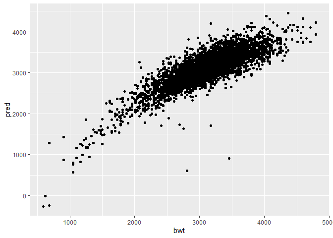
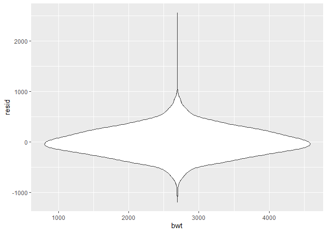
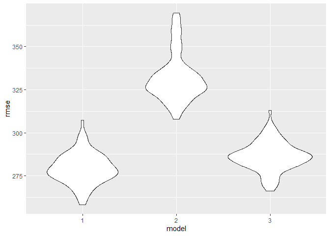
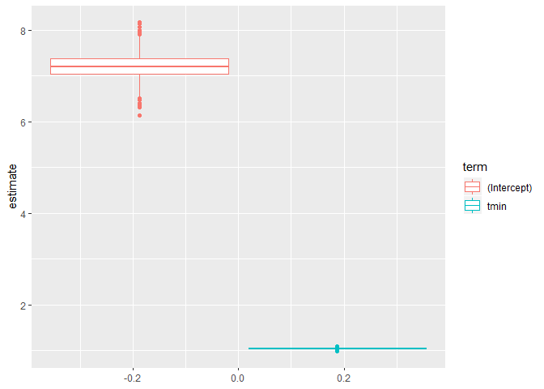

p8105\_hw6\_dw2903
================
Di Wu dw2903
2019/11/25

``` r
birthweight = read.csv("./birthweight.csv")
weather_df = 
  rnoaa::meteo_pull_monitors(
    c("USW00094728"),
    var = c("PRCP", "TMIN", "TMAX"), 
    date_min = "2017-01-01",
    date_max = "2017-12-31") %>%
  mutate(
    name = recode(id, USW00094728 = "CentralPark_NY"),
    tmin = tmin / 10,
    tmax = tmax / 10) %>%
  select(name, id, everything())
```

    ## Registered S3 method overwritten by 'crul':
    ##   method                 from
    ##   as.character.form_file httr

    ## Registered S3 method overwritten by 'hoardr':
    ##   method           from
    ##   print.cache_info httr

    ## file path:          C:\Users\dylan\AppData\Local\rnoaa\rnoaa\Cache/ghcnd/USW00094728.dly

    ## file last updated:  2019-09-26 10:26:11

    ## file min/max dates: 1869-01-01 / 2019-09-30

## Problem 1

clean data

``` r
birthweight = 
  birthweight %>%
  janitor::clean_names() %>%
  mutate(
    babysex = as.factor(babysex),
    frace = as.factor(frace),
    malform = as.factor(malform),
    mrace = as.factor(mrace),
  )
```

    ## Warning in FUN(X[[i]], ...): strings not representable in native encoding
    ## will be translated to UTF-8

creat regression 1 that hypothesis the birthweight is related baby’s
condition as well as family income and mother’s weight

``` r
fit_1 = lm(bwt~babysex+bhead+blength+delwt+fincome+gaweeks,data = birthweight)
fit_1 %>%
  broom::tidy() %>%
  knitr::kable(digits = 3)
```

| term        |   estimate | std.error | statistic | p.value |
| :---------- | ---------: | --------: | --------: | ------: |
| (Intercept) | \-6283.677 |    96.416 |  \-65.173 |       0 |
| babysex2    |     32.429 |     8.687 |     3.733 |       0 |
| bhead       |    136.062 |     3.524 |    38.605 |       0 |
| blength     |     79.344 |     2.059 |    38.532 |       0 |
| delwt       |      2.016 |     0.198 |    10.177 |       0 |
| fincome     |      1.197 |     0.166 |     7.229 |       0 |
| gaweeks     |     12.938 |     1.491 |     8.679 |       0 |

in this model the bwt is strongly related to all the factors in the
model including baby sex, baby’s head circumference at birth, baby’s
length at birth, mother’s weight, family monthly income, gestational
age, showing a very small p value for the coeficient of all the factors

``` r
modelr::add_predictions(birthweight,fit_1) %>%
  ggplot(aes(x=bwt,y=pred))+geom_point()
```

<!-- -->

``` r
modelr::add_residuals(birthweight,fit_1) %>%
  ggplot(aes(x=bwt,y=resid))+geom_violin()
```

<!-- --> the
prediction value and the observed value mostly have very little
residules with several outliers and most of outliers have positive
residuals.

creat linear models to compare

``` r
fit_2= lm(bwt~blength+gaweeks, data=birthweight)
fit_3= lm(bwt~bhead*blength*babysex,data = birthweight)
```

### cross validation

``` r
cv_bw=
  crossv_mc(birthweight,100) %>%
  mutate(
    train = map(train, as_tibble),
    test = map(test,as_tibble)
  ) 
```

``` r
cv_bw_map=
  cv_bw %>%
  mutate(
    lm_1 = map(train,~lm(bwt~babysex+bhead+blength+delwt+fincome+gaweeks,data = birthweight)),
    lm_2 = map(train,~lm(bwt~blength+gaweeks, data=birthweight)),
    lm_3 = map(train,~lm(bwt~bhead*blength*babysex,data = birthweight))
  ) %>%
  mutate(
    rmse_1 = map2_dbl(lm_1,test,~rmse(model= .x, data=.y)),
    rmse_2 = map2_dbl(lm_2,test,~rmse(model=.x, data=.y)),
    rmse_3 = map2_dbl(lm_3,test,~rmse(model=.x, data=.y)),
  )
```

``` r
cv_bw_map%>%
  select(starts_with("rmse")) %>%
  pivot_longer(
    everything(),
    names_to = "model",
    values_to = "rmse",
    names_prefix = "rmse_"
  ) %>%
  mutate(model=fct_inorder(model)) %>%
  ggplot(aes(x=model, y=rmse)) +geom_violin()
```

<!-- -->
base on the rmse model comparison, the hypothesis model including baby
sex, baby’s head circumference at birth, baby’s length at birth,
mother’s weight, family monthly income, gestational age are better
representative than the models for reference.

## Problem 2

bootstrap dataframe

``` r
boot_sample = function(df) {
  sample_frac(df, replace = TRUE)
}

boot_weather = 
  data_frame(
    strap_number = 1:5000,
    strap_sample = rerun(5000,boot_sample(weather_df))
  ) %>%
  mutate( 
    models= map(strap_sample,~lm(tmax~tmin,data=.x)),
    results= map(models, broom::glance),
    results_2= map(models,broom::tidy)
    ) %>%
  select(-strap_sample,-models) %>%
  unnest()%>%
  select(
    term, strap_number, r.squared, estimate
  )  
```

    ## Warning: `data_frame()` is deprecated, use `tibble()`.
    ## This warning is displayed once per session.

    ## Warning: `cols` is now required.
    ## Please use `cols = c(results, results_2)`

``` r
boot_weather %>%
  ggplot(aes(y=estimate,color=term))+geom_boxplot()
```

<!-- -->

``` r
boot_weather %>%
  group_by(term)%>%
  summarize(
    estimate = mean(estimate)
  )
```

    ## # A tibble: 2 x 2
    ##   term        estimate
    ##   <chr>          <dbl>
    ## 1 (Intercept)     7.21
    ## 2 tmin            1.04

as showing in plot, the estimator coefficient are generally normally
distributed with average value of 7.208 in intercept while 1.040 for
coefficient of tmin

``` r
boot_weather%>%
  pivot_wider(
    names_from = term,
    values_from = estimate
  ) %>%
  janitor::clean_names()%>%
  summarize(
    r_squared_left = mean(r_squared)-sd(r_squared)*qt(0.975,df=4999)/sqrt(5000),
    r_squared_right = mean(r_squared)+sd(r_squared)*qt(0.975,df=4999)/sqrt(5000),
    coef_left = mean(log(intercept*tmin))-sd(log(intercept*tmin))*qt(0.975,df=4999)/sqrt(5000),
    coeft_right = mean(log(intercept*tmin))+sd(log(intercept*tmin))*qt(0.975,df=4999)/sqrt(5000),
    
  )
```

    ## # A tibble: 1 x 4
    ##   r_squared_left r_squared_right coef_left coeft_right
    ##            <dbl>           <dbl>     <dbl>       <dbl>
    ## 1          0.911           0.912      2.01        2.01

The R^2 is in (0.9112487,0.9117194) and log(β0\*β1) is in
(2.012493,2.01381)
